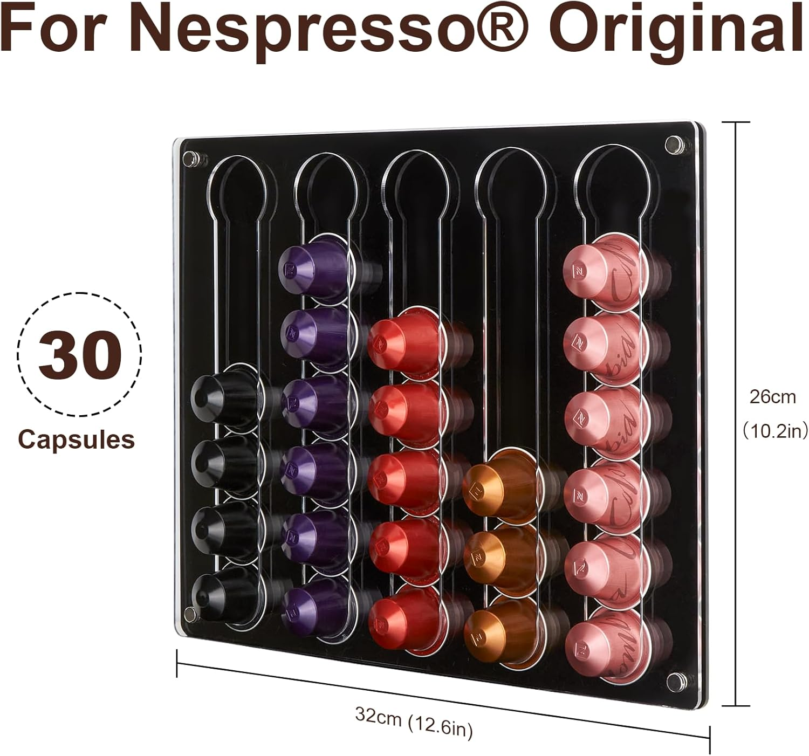

## Distributeur de Capsules Intelligent

- **Concept et Objectif Principal**
  - Ce projet vise à développer un distributeur automatique de capsules de café, fonctionnant sur le principe d'une boîte aux lettres ou d'un casier de stockage personnel.
  - Fonctionnalité clé : Chaque utilisateur dispose d'un compartiment de stockage individuel (casier). L'accès au compartiment (pour déposer ou récupérer des capsules) est strictement conditionné par une authentification personnelle via un compte utilisateur.

- **Stratégie de Simplification de la Conception**
    Afin de réduire drastiquement la complexité de la conception mécanique et de l'impression 3D, la stratégie adoptée est la suivante :

    - Réutilisation du Rangement Existant : Nous allons acheter un rangement pour capsule (un support de stockage ou un organisateur) disponible sur le marché.
    - Concentration sur le Mécanisme : Le développement et la conception 3D se concentreront uniquement sur l'ajout des mécanismes de verrouillage et d'ouverture (actionneurs, charnières) sur ce rangement existant, plutôt que de concevoir l'intégralité du système de distribution à partir de zéro.

    Cette approche permet de minimiser l'effort de prototypage et d'accélérer la phase de développement.  

- **Architecture Technique du Système**

    Le système repose sur une architecture modulaire utilisant trois composants principaux :

| Composant | Rôle | Détails Techniques |
| :--- | :--- | :--- |
| **Authentification & Contrôle (Cerveau)** | **Raspberry Pi** | Gère la logique complexe, les bases de données d'utilisateurs et le système de connexion. Il sera connecté à des périphériques externes pour l'authentification (ex: **reconnaissance faciale, lecteur d'empreintes, scan de codes QR**). |
| **Contrôle Physique (Mouvement)** | **Arduino** | Responsable du contrôle direct des actionneurs (servomoteurs, électroaimants) qui permettent l'ouverture et la fermeture physique des différents casiers de stockage. |
| **Interface Utilisateur (IHM)** | **Application Android** | Fournit l'interface utilisateur pour l'accès au compte, la gestion des casiers et l'interaction avec le système (envoi des commandes d'ouverture au Raspberry Pi). |

- **Évolution Logicielle Future (Fonctionnalités Additionnelles)**
Une fois que la plateforme matérielle de base (mécanisme de verrouillage et authentification) est fonctionnelle, l'accent sera mis sur l'ajout de fonctionnalités logicielles avancées via l'application Android :

    - Partage de Capsules : Permettre aux utilisateurs de proposer des capsules en surplus à d'autres membres du système.
    - Historique et Inventaire : Mise en place d'un suivi de l'utilisation et d'une gestion de l'inventaire des capsules restantes dans chaque casier.
    - Notifications : Ajout d'alertes automatiques (ex: stock faible, capsule préférée disponible). 

## Infos

- [Lien de rangemant](https://amzn.eu/d/jfPP7i2)
- 
- [iRasptek Raspberry Pi 5 Kit de démarrage 8Go - Édition OS-Bookworm de 64Go préinstallée (boîtier Rouge et Blanc)](https://amzn.eu/d/6CCp4Q8)